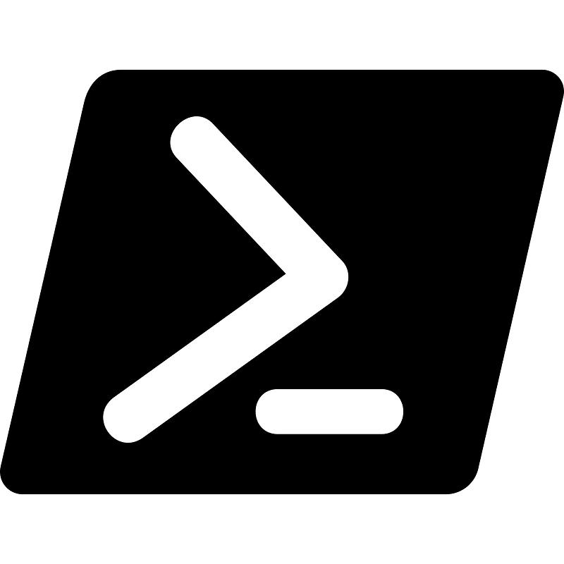

<a name="readme-top"></a>

<!-- PROJECT LOGO -->
<br />
<div align="center">
<table style="border-collapse: collapse;">
  <tr>
    <td>
      <a href="https://github.com/clemans/net.clemans.Powershell.ADCleanup/">
        
      </a>
    </td>
  </tr>
</table>
  <h3 align="center">Active Directory Clean-up Report</h3>
  <p align="center">
    An Active Directory Cleanup reporting script powered by Microsoft Powershell.
    <br />
    <a href="https://github.com/clemans/net.clemans.Powershell.ADCleanup/">
      <strong>Explore the docs</strong>
    </a>
    <br />
    <br />
    <a href="https://github.com/clemans/net.clemans.Powershell.ADCleanup/">
      View Demo
    </a>
    •
    <a href="https://github.com/clemans/net.clemans.Powershell.ADCleanup/issues">
      Report Bug
    </a>
    •
    <a href="https://github.com/clemans/net.clemans.Powershell.ADCleanup/issues">
      Request Feature
    </a>
  </p>
</div>

<!-- TABLE OF CONTENTS -->
<details>
  <summary>Table of Contents</summary>
  <ol>
    <li>
      <a href="#about-the-project">About The Project</a>
      <ul>
        <li><a href="#built-with">Built With</a></li>
      </ul>
    </li>
    <li>
      <a href="#getting-started">Getting Started</a>
      <ul>
        <li><a href="#prerequisites">Prerequisites</a></li>
      </ul>
    </li>
    <li><a href="#roadmap">Roadmap</a></li>
    <li><a href="#contributing">Contributing</a></li>
    <li><a href="#license">License</a></li>
    <li><a href="#contact">Contact</a></li>
    <li><a href="#acknowledgments">Acknowledgments</a></li>
  </ol>
</details>

## About The Project

A generated report of Active Directory accounts safe to have their data "cleaned up" (or deleted).

### Built With

Below is the technology used to bootstrap this project.

- [![powershell][powershell]][powershell-url]

<p align="right">(<a href="#readme-top">back to top</a>)</p>

## Getting Started

For a manual deployment, follow the below instructions and prerequisites.

### Prerequisites

- Install the latest version of [Powershell][powershell-url].

```powershell
  PS /home/$USER/> ./bin/entrypoint.ps1
```

<p align="right">(<a href="#readme-top">back to top</a>)</p>

## Roadmap

  | TO DO           | Description                                    | Status
  | --              | --                                             | --
  | Unit Coverage   | Adds Unit Test support                         | 📑 Backlog

See the [open issues][issue-url]
for a full list of proposed features and known issues.

<p align="right">(<a href="#readme-top">back to top</a>)</p>

## Contributing

Contributions are what make the open source community
such an amazing place to learn, inspire, and create. Any contributions you make are
**greatly appreciated**.

If you have a suggestion that would make this better, please fork the repo & create a pull request.
You can also simply open an issue with the tag "enhancement".
Don't forget to give the project a star! Thanks again!

1. Create your Feature Branch (`git checkout -b feature/itil-issue-number`)
2. Commit your Changes (`git commit -m 'Add some AmazingFeature'`)
3. Push to the Branch (`git push origin feature/itil-issue-number`)
4. Open a Pull Request

<p align="right">(<a href="#readme-top">back to top</a>)</p>

## License

Distributed under the MIT License. See `LICENSE.txt` for more information.

<p align="right">(<a href="#readme-top">back to top</a>)</p>

## Contact
Open a [GitHub Issue][issue-url].

## Acknowledgments

Thanks to all the projects and services to making this possible:

- [Choose an Open Source License](https://choosealicense.com)
- [Img Shields](https://shields.io)

<p align="right">(<a href="#readme-top">back to top</a>)</p>

<!-- https://www.markdownguide.org/basic-syntax/#reference-style-links -->
[powershell]: https://img.shields.io/badge/Powershell-v7.2.1-green?style=appveyor&logo=powershell
[powershell-url]: https://github.com/PowerShell/PowerShell

[issue-url]: https://github.com/clemans/net.clemans.Powershell.ADCleanUp/issues/